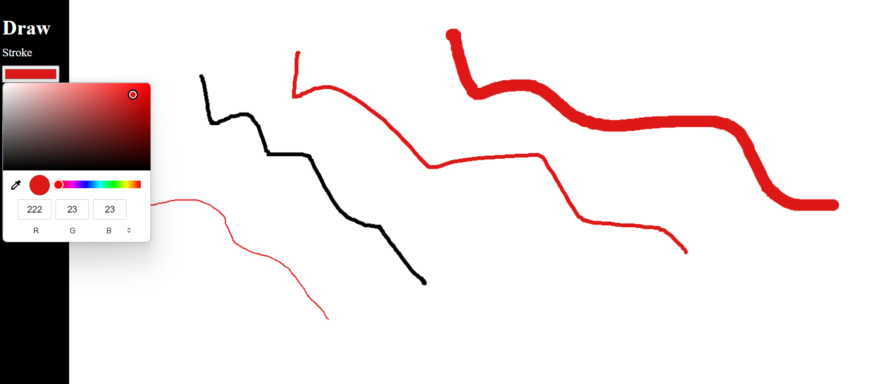
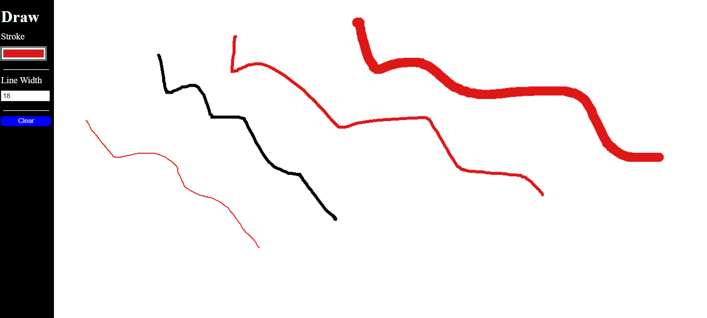

Painter
This repository contains an intuitive and interactive painting application implemented using JavaScript and the HTML5 canvas element. The application allows users to create digital artwork with a variety of tools and colors, offering a simple platform for creative expression.

Features
Brush Tool: Paint with different brush sizes and colors.
Eraser Tool: Easily erase mistakes or unwanted sections of your artwork.
Color Picker: Choose from a wide range of colors to customize your brush.
Clear Canvas: Start fresh with a single click to clear the entire canvas.
Save Artwork: Save your artwork as an image file to your device.(not implimented yet)

0.1v
